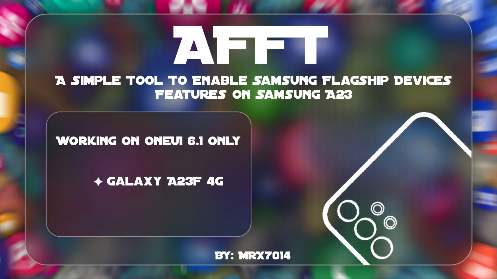

# AFFT - A23 Flagship Features Tool

<div align="center">
  
**A Simple Tool To Enable Samsung Flagship Devices Features on Samsung A23**

**Working on OneUI 6.1 Only**

<br />

# V4.2.1 - Stable Released

</div>

### ✨️Features:

⚙️System:
- High-End Animations
- Performance Profile
- Processing Speed
- Smooth Scroll
- Dolby Atmos without Headsets
- Dolby Atmos in Games
- Dolby Atmos Game Profiles
- Flagship Edge Ligthining+
- Disable Index Scroll
- Multi Users
- S23 Ultra Props
- Improve voice call quality
- Improves audio and video recording quality
- Better signal
- Faster Boot
- Better Responsiveness & Speed
- Video Acceleration Enabled And HW debugging
- Zygote Preforking
- Enable 4K in YouTube "Working with Youtube Vanced"
- Discrease call delay
- Save Battery Without Performance Drop
- FPS Stabilizer
- Audio Improvements
- Samsung Ai
- Screen Recorder
- Call Recorder
- Better RAM managment
- Disables sending of usage data
- Faster&Better&More ResponsiveScrolling
- Liquid Smooth Ui (not the custom rom)
- Makes apps load faster and frees more ram
- Increase jpg quality to 100%
- Rendering Tweaks
- Qualcomm tweaks
- Faster streaming videos
- Dalvik Virtual Machine tweaks
- Auto Rotation on Lock Screen
- Force 270 Degree Rotation on All Apps
- Make Phone Ring as soon as you get a Call

📷Camera:
- Zoom bar in Pro video
- Slow Motion
- Hyperlapse UHD
- Improved HDR
- Single-take video
- Expert RAW
- Pro Mode
- Pro Video Mode

### First

> [!IMPORTANT]
> **Your System Partition Should Be Read/Write, Read this to know how to do this** <a href="https://telegra.ph/How-to-convert-System-form-Read-Only-to-Read-Write-05-06">Here</a>

- **Download Termux App:** <a href="https://github.com/termux/termux-app/releases/download/v0.118.0/termux-app_v0.118.0+github-debug_arm64-v8a.apk">**Here**</a>

### Then

- Copy this command to install required packages
```sh
pkg update ; pkg install git
```

<br>

- After install packages copy this command to clone the tool and run it
```sh
git clone https://github.com/mrx7014/AFFT ; cd AFFT ; chmod +x AFFT.sh ; ./AFFT.sh
```

<br>

**Now tool is working, Have Fun :)**

<hr>

# Credits:
<a href="https://xdaforums.com/t/additional-features-for-samsung-devices.4181105/#post-83781033">**el0xren XDA**</a>

<br>

<a href="https://t.me/SamsungTweaks">**Samsung Tweaks Telegram Channel**</a>

<br>

<a href="https://t.me/A235channel">**A23 Telegram Channel**</a>
